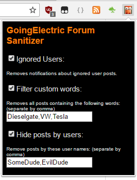

GoingElectric Forum Sanitizer
=====================

A chrome browser extension for removing redundant posts from the GoingElectric Forums.
Based on the Antiduino plugin from https://github.com/SickSad/HaD-AntiDuino

Installation
------------

To install the extension follow the following steps:

* Unpack this ZIP somewhere.
* Load chrome and go to Menu->Tools->Extensions
* Tick the checkbox entitled "Developer Mode"
* Click the button titled "Load unpacked extension..."
* Navigate to the root of where you extracted the contents of the ZIP file and click "Open".
* Tada!!

Usage
-----
A new extension icon should appear on the top bar of chrome (the muppet), clicking it will allow you to enable a number of extension options. Once you have enabled an option you will need to reload the page for them to take effect.

(Note - Only works on https://www.goingelectric.de)
